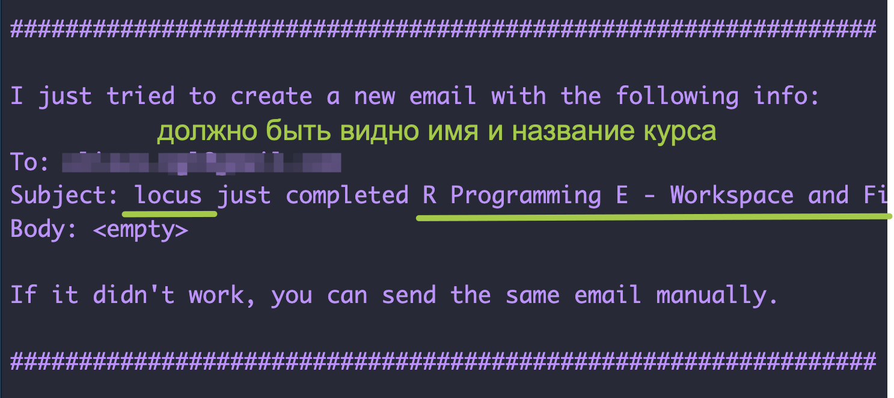

# Начало работы с R

## Что такое R?

R --- это язык программирования для статистической обработки данных и работы с графикой. Он создан в 90-х гг. на факультете статистики Оклендского университета. Иными словами, его делали статистики и для статистиков. Поэтому он прекрасно подходит для анализа данных, статистических вычислений и машинного обучения, а значит востребован в науке.

> Язык R --- один из самых распространённых в научной среде. Им пользуются математики, биологи, генетики и другие учёные, которым нужно проводить статистические исследования и строить модели. Поэтому язык R нужно изучать тем, кто планирует заниматься научными исследованиями.
>
> --- Яндекс Практикум [Блог](https://practicum.yandex.ru/blog/chto-takoe-yazyk-r/#chto-takoe)

После установки R вы получите доступ к уже готовым методам статистического анализа и инструментам для визуализации. Но за счет того, что R распространяется свободно, постоянно появляются новые алгоритмы, созданные внутри экспертного сообщества и тоже доступные для всех. Как и любой язык, R растет и развивается.

## Пакеты и виньетки

Если в базовой инсталляции R нет нужного решения -- имеет смысл поискать в библиотеке **пакетов**. Пакет -- это **набор функций** и иногда датасетов, созданный пользователями. На 1 июля 2023 г. в репозитории [CRAN](https://cran.r-project.org/) доступно 19789 пакетов. И это далеко не все: многие пакеты доступны только на GitHub, например [пакет Dracor](https://rdrr.io/github/dracor-org/rdracor/f/README.md), к которому я буду обращаться в рамках этого курса.

::: {.infobox .info}
Некоторые функции, которые вы найдете в пакетах, частично дублируют друг друга -- это нормально, как и в естественном языке, "сказать" что-то можно разными способами.
:::

Несмотря на то, что R создавался изначально для работы со статистикой, система свободно распространяемых модулей значительно расширяет круг задач, которые можно решать на этом языке. Например, благодаря модулю Shiny можно создавать [приложения](https://locusclassicus.shinyapps.io/myshinyapp/) и встраивать их в веб-страницы, а модуль Leaflet позволяет создавать интерактивные карты. [Одну из них](http://antibarbari.ru/2023/03/01/cicero_villas/) мы сделали в рамках проекта Antibarbari HSE.

По технической документации и так называемым "виньеткам" можно понять, какой пакет вам нужен. Например, вот так выглядит [виньетка](https://docs.ropensci.org/rperseus/articles/rperseus-vignette.html) пакета `RPerseus`, при помощи которого можно получить доступ к корпусу греческой и латинской литературы.

Бывают еще **"пакеты пакетов"**, то есть очень большие семейства функций, своего рода "диалекты" R. Таково, например, семейство `tidyverse`, объединяемое идеологией "опрятных" данных. Про него мы еще будем говорить.

## Если не хватает пакетов

Это самое интересное. Если вы работаете в программе с графическим интерфейсом (SPSS, Minitab), то вы вынуждены формулировать свою задачу так, чтобы "вписаться" в набор кнопок, предусмотренных разработчиком. В R, столкнувшись с особой задачей, вы просто пишете под нее особую функцию.

Новую функцию не обязательно публиковать в составе пакета -- можно сохранить в рабочую директорию (с расширением `.R`) и наслаждаться самому. По мере того, как развиваются ваши навыки программирования, вы можете ставить и решать все более сложные и интересные задачи.

## О воспроизводимости

Когда вы решите опубликовать свое исследование, то и код к нему придется опубликовать (как правило, для этого используется GitHub) -- поэтому надо сразу привыкать кодить так, чтобы ваш код был понятен другим. Например, добавлять пояснения при помощи знака `#` (как в Python)

```{r}
# случайный набор чисел из нормального распределения
x <- rnorm(1000)
# случайная выборка из этого набора
y <- sample(x, 100)
```

В идеале, впрочем, вы поясняете не то, *что* код делает (при грамотном кодинге это должно быть самоочевидо), а *зачем*.

В этом примере код, правда, настолько простой, что не требует особых пояснений. Но в больших проектах от "читабельности" кода зависит не только то, поймет ли вас потенциальный рецензент, но и сможете ли вы сами вспомнить, какая строчка за что отвечает. Также это позволит вернуться к проекту через некоторое время и быстро вспомнить, что там происходит.

Если вы получите интересные результаты и решите их опубликовать, то выложить в открытый доступ придется не только код, но и данные (если они не защищены копирайтом или другими ограничениями). Таким образом рецензент или другие ученые, которые будут читать вашу статью, сможет перепроверить ваши выводы. Ученые так делают!

И это еще один довод в пользу того, чтобы научиться программировать, а не полагаться на ПО с графическим интерфейсом.

## Что мы (не) будем делать?

Хотя возможности R очень широки, мы будем заниматься в основном анализом текстовых данных. "Текст" в данном случае можно понимать как зафиксированную (в машиночитаемом виде) речь: от отзыва на товар до романа. Но в основном данные я подбираю таким образом, чтобы они были интересны гуманитариям.

Курс включает в себя два основных блока и 16 уроков:

-   общее введение в R (темы 1-8)
-   text-mining (темы 9-16)

**Часть 1. Общее введение в R** 

1. Знакомство с R и RStudio. Начало работы. Объекты, функции, операторы. 
2. Визуализация данных: базовый R, lattice, ggplot2 
3. Трансформация данных. «Опрятные» данные с dplyr и tidyverse. 
4. Условия и циклы. Написание собственных функций. Итерации с purrr. 
5. Импорт данных. Импорт данных из XML. 
6. Воспроизводимые исследования. RMarkdown. 
7. Регулярные выражения: базовый R и stringr 
8. Веб-скрапинг. 
*Консолидация: промежуточный проект*

**Часть 2. Text Mining** 

9. Токенизация. Морфологический и синтаксический анализ. 
10. Анализ эмоциональной тональности. 
11. Распределения слов и анализ частотности. 
12. Cкрытое распределение Дирихле (LDA). 
13. Латентно-семантический анализ. 
14. Кластеризация и метод главных компонент. 
15. Построение сетей в R. 
16. Описание и анализ сетей. 
*Консолидация: итоговый проект*

Мы *не будем*:

-   анализировать звучащую речь (хотя это тоже [можно делать](https://ling.hse.ru/news/671710245.html) в R);
-   распознавать рукописные символов, для этого есть гораздо другие [мощные инструменты](https://vk.com/video-211800158_456239315);
-   изучать машинное обучение и нейронные сети;
-   разрабатывать приложения.


Домашние и самостоятельные задания в основном будут проходить в виде интерактивных уроков с использованием пакета `swirl`. 

Если вы плохо представляете, на что вообще способны количественные методы в гуманитаристике, посмотрите видео панельной дискуссии ["Цифровые инструменты и методы: в чем их польза и как им обучить гуманитария?"](https://vk.com/video-211800158_456239307) (НИУ ВШЭ, 2023 г.). Это видео о том, зачем. О том, как -- дальше.

## RStudio

Работать в R мы будем с использованием RStudio. Это свободная среда разработки (IDE) программного обеспечения с открытым исходным кодом для языка программирования R.

Наша задача в этом уроке -- установить R и R Studio и убедиться, что все работает; научиться самостоятельно находить помощь, совершать несложные вычисления.

## Установка

1.  Установить R

-   Скачать R для Windows: <https://cran.r-project.org/bin/windows/>
-   Скачать R для Mac: <https://cran.r-project.org/bin/macosx/>
-   Скачать R для Linux: <https://cran.r-project.org/bin/linux/>

2.  Установить R Studio

-   Скачать: <https://www.rstudio.com/products/rstudio/download/> (достаточно бесплатной версии)

::: {.infobox .info}
На MacOS для работы библиотеки Stylo также понадобится установить XQuartz: <https://www.xquartz.org/>
:::


Можно пользоваться R в облаке: <https://posit.cloud/> (нужна регистрация).

## Начало работы

После установки и запуска RStudio вы увидите вот такие четыре панели (их названия подписаны на картинке):

](https://docs.posit.co/ide/user/ide/guide/ui/images/rstudio-panes-labeled.jpeg)


</br>
Для начала попробуйте получить информацию о сессии, введя в **консоли** такую команду:

```{r eval=FALSE}
sessionInfo()
```

`sessionInfo()` -- это **функция**. За названием функции всегда следуют круглые скобки, внутри которых могут находиться **аргументы функции**. О функциях можно думать как о глаголах ("сделай то-то!"). Аргументы -- это что-то вроде дополнений и обстоятельств. (Кстати, в "диалекте" tidyverse есть функции-наречия, так что аналогия законная.) Аргументы могут быть обязательные и необязательные.

Чтобы узнать, каких аргументов требует функция, надо вызывать **help**: `?mean()`. Также можно (и нужно) читать техническую документацию к пакетам.


```{r echo=FALSE}
library(checkdown)
```

:::: {.ask .question}
Сколько аргументов функции `mean()` имеют значения по умолчанию?

```{r results='asis', echo=F}
check_question(answer = 2, right = "Все верно!", wrong = "Не совсем. Значения по умолчанию стоят после знака `=`")
```
::::

</br>
Уточнить свою **рабочую директорию** (в которой R будет искать и сохранять файлы) можно при помощи функции `getwd()` без аргументов. Установить рабочую директорию можно при помощи функции `setwd()`, указав в качестве аргумента путь к рабочей директории на вашем компьютере (в кавычках, так как это символьный вектор). В моем случае это выглядит так:

```{r eval=FALSE}
setwd("/Users/olga/R_Workflow/")
```

Также для выбора рабочей директории можно использовать меню R `Session > Set Working Directory`.

Пакеты для работы устанавливаются один раз, однако подключать их надо во время каждой сессии. Чтобы установить новый пакет, можно воспользоваться меню `Tools > Install Packages`. Также можно устанавливать пакеты из консоли. Установим пакет с интерактивными уроками программирования на языке R:

```{r eval=FALSE}
install.packages("swirl")
```

Для подключения используем функцию `library()`, которой передаем в качестве аргумента название пакета без кавычек:

```{r eval=FALSE}
library(swirl)
```


В R можно создавать проекты, и это очень удобно^[https://intro2r.com/rsprojs.html].

А теперь -- первое задание на кодинг. После выполнения `swirl` предложит отправить e-mail преподавателю; ответьте `Yes` и сделайте скриншот сообщения об отправке.  Если задание оценивается, укажите имя так, чтобы вас можно было узнать. Вот пример:




::::{.task .code}
Установите курс программирования на R: `install_course("R Programming E")`.  После этого привяжите пакет командой `library(swirl)` и выполните следующую команду: `swirl()`. Укажите ваше имя. Пройдите урок  2 `Workspace and Files`.
::::

</br>
После выполнения ответьте на несколько вопросов на закрепление материала. 

::::{.ask .question}
Какие действия в рабочей директории можно совершать из консоли?
::::

```{r results='asis', echo=F}
check_question(answer = c("создать директорию", "удалить директорию", "создать файл", "переименовать файл", "копировать файл", "удалить файл"), options = c("создать директорию", "удалить директорию", "создать файл", "переименовать файл", "копировать файл", "удалить файл"), type = "checkbox", right = "Все возможно в дивном мире R!", wrong = "Чего-то не хватает...")
```

::::{.ask .question}
Чтобы создать вложенную директорию при помощи функции `dir.create()`, аргументу `recursive` следует задать значение...
::::

```{r results='asis', echo=F}
check_question("TRUE", options = c("TRUE", "FALSE"), right = "Гениально!", wrong = "Подсказка: рекурсия — это определение, описание, изображение какого-либо объекта или процесса внутри самого этого объекта или процесса", type = "select")
```

Если все получилось, двигаемся дальше.

## R как калькулятор

Можно использовать R как калькулятор. Для этого вводим данные рядом с символом приглашения `>`, который называется **prompt**.

```{r}
sqrt(4) # квадратный корень
2^3 # степень
log10(100) #логарифм
```

Если в начале консольной строки стоит `+`, значит предыдущий код не завершен. Например, вы забыли закрыть скобку функции. Ее можно дописать на следующей строке. Попробуйте набрать `sqrt(2` в консоли.

## Операторы присваивания

Чтобы в окружении появился новый объект, надо присвоить результат вычислений какой-нибудь переменной при помощи **оператора присваивания** `<-` (`Alt` + `-` (Windows) или `Option` + `-` (Mac)). Знак `=` также работает как оператор присваивания, но не во всех контекстах, поэтому им лучше не пользоваться.

```{r}
x <- 2 + 2 # создаем переменную
y <- 0.1 # создаем еще одну переменную
x <- y # переназначаем  
x + y
```

**Имя переменной**, как и имя функции, может содержать прописные и строчные буквы, точку и знак подчеркивания. Функция `c()` позволяет собрать несколько элементов в единый вектор:

```{r}
x <- c(3, 5, 7)
x_mean <- mean(x) # также возможно x.mean или xMean
x_mean
```

В диалекте tidyverse предпочтение отдается подчеркиванию, а не точке; здесь сказывается влияние синтаксиса Python, где через точку получают доступ к методам объекта. Будьте внимательны: R чувствительна к регистру!

::: {.infobox .info}
**Объекты, предназначенные для хранения данных**, -- это отдельные переменные, векторы, матрицы и массивы, списки, факторы, таблицы данных. **Функции** -- это поименованные программы, предназначенные для создания новых объектов или выполнения определенных действий над ними [@мастицкий2015, 24]
:::

Как вы уже знаете из урока в `swirl`, список всех объектов в окружении возвращает функция `ls()`. Удалять объекты можно при помощи `rm()`. Функции можно вкладывать друг в друга:

```{r eval=FALSE}
rm(list = ls()) # удаляет все объекты в окружении
```


</br>
::::{.task .code}
Снова запустите `swirl()`. Укажите ваше имя. Пройдите урок 1 `Basic Building Blocks`. 
::::

Если все получилось, можно двигаться дальше! Но сначала зафиксируем несколько новых функций из этих первого урока. 

:::: {.ask .question}
Что вычисляет функция `abs()`?
::::

```{r results='asis', echo=F}
check_question("модуль", options = c("среднее", "модуль", "квадратный корень"), type = "radio", right = "Все верно!", wrong = "Не совсем.")
```

:::: {.ask .question}
Сколько значений вернет функция, если разделить `c(2, 4, 6)` на `2`?
::::

```{r results='asis', echo=F}
check_question(answer = 3, right = "Все верно!", wrong = "Не совсем.")
```

::::{.ask .question}
Буква "c" в названии функции `c()` означает...
::::

```{r results='asis', echo=F}
check_question("concatenate", options = c("cover", "collapse", "concatenate"), type = "radio", right = "Все верно!", wrong = "Не совсем.")
```

## Векторы

В языке R нет скаляров (отдельных чисел). Числа считаются векторами из одного элемента.

```{r}
x <- 2
class(x) # числовой вектор
length(x) # длина вектора
```

Основные типы данных, с которыми мы будем работать, следующие:

-   целое число (integer)
-   число с плавающей точкой (numeric, также называются double, то есть число двойной точности)
-   строка (character)
-   логическая переменная (logical)
-   категориальная переменная, или фактор (factor)

```{r}
# проверить тип данных 
x <- sqrt(2)
class(x)
is.integer(x)
is.numeric(x)
```

Для начала мы научимся генерировать векторы. Например, так.

```{r}
seq(1, 5, 0.5)
rep("foo", 5)
```

::::{.task .code}
Запустите `swirl()` и пройдите урок 3 `Sequences of Numbers`.
::::

Проверьте свои знания, прежде чем двигаться дальше.

::::{.ask .question}
Какие числа вернет команда `pi:10`?
::::

```{r results='asis', echo=F}
check_question("вещественные", options = c("натуральные", "целые", "рациональные", "вещественные", "комплексные"), type = "radio", right = "Все верно!", wrong = "Не совсем.")
```

::::{.ask .question}
Какие функции могут использоваться для создания _символьных_ векторов?
::::

```{r results='asis', echo=F}
check_question(c("c()", "rep()"), options = c("seq()", "rep()", "c()"), type = "checkbox", right = "Ну это же просто фантастика!", wrong = "Не совсем.")
```

::::{.ask .question}
Сколько значений вернет команда `rep(c(0, 1, 2), times = 10)`? Посчитайте в уме, не выполняя код.
::::

```{r results='asis', echo=F}
check_question(answer =  30, right = "Ах, красота!", wrong = "Надо бы пересчитать.")
```

</br>
**Факторы** внешне похожи на строки, но в отличие от них хранят информацию об *уровнях* категориальных переменных. Уровень может обозначаться как числом (например, 1 и 0), так и строкой.

```{r}
t <- factor(c("A", "B", "C"), levels = c("A", "B", "C"))
t
```

При попытке объединить в единый вектор данные разных типов, они будут принудительно приведены к одному типу:

```{r}
x <- c(TRUE, 1, 3, FALSE)
x # логические значения переработаны в числовые

y <- c(1, "a", 2, "лукоморье") # строки всегда в кавычках
y # числа превратились в строки
```

](https://d33wubrfki0l68.cloudfront.net/1d1b4e1cf0dc5f6e80f621b0225354b0addb9578/6ee1c/diagrams/data-structures-overview.png){width="60%"} 

</br>
**Логические векторы** можно получить в результате применения **логических операторов** (`==` "равно", `!=` "не равно", `<=` "меньше или равно") к данным других типов:

```{r}
x <- c(1:10) # числа от 1 до 10
y <- x > 5
y # значения TRUE соответствуют единице, поэтому их можно складывать
sum(y)
```

</br>

::::{.task .code}
Здесь можно запустить `swirl()` и пройти урок  8 `Logic`. Это не обязательно, но очень полезно, если хотите разобраться в операторах!
::::

</br>

::::{.ask .question}
Попробуйте посчитать в уме: какое из выражений ниже вернет значение `TRUE`?
::::

```{r results='asis', echo=F}
check_question(answer = "-6 > -7", type = "radio", right = "Восторг!", wrong = "Посмотрите внимательнее.", options = c("7 == 9", "!(57 != 8)", "9 >= 10", "-6 > -7"))
```

Функции `all()` и `any()` также возвращают логические значения:

```{r}
x <- 10:20 
any(x == 15)
all(x > 9)
```

::::{.task .code}
Запустите `swirl()` и пройдите урок  4 `Vectors`. Это позволит больше узнать про логические и символьные векторы.
::::

Несколько вопросов для самопроверки.

::::{.ask .question}
Какие значение вернет команда `(3 > 5) & (4 == 4)`?
::::

```{r results='asis', echo=F}
check_question("FALSE", options = c("TRUE", "FALSE", "NA"), right = "Железная логика!", wrong = "Нет, одно из условий невыполнимо")
```

::::{.ask .question}
Какие значения вернет команда `(TRUE == TRUE) | (TRUE == FALSE)`?
::::

```{r results='asis', echo=F}
check_question("TRUE", options = c("TRUE", "FALSE", "NA"), right = "Восхищаемся вами", wrong = "Это дизъюнкция...")
```

::::{.ask .question}
Команда `paste(LETTERS, 1:4, sep = "-")` вернет...
::::

```{r results='asis', echo=F}
check_question("символьный вектор длиной 26", 
               options = c("числовой вектор длиной 26", "символьный вектор длиной 26", "числовой вектор длиной 4", "символьный вектор длиной 4", "ошибку"),
               right = "Гениально💡", 
               wrong = "Не совсем.",
               type = "radio")
```

</br>
Над векторами можно совершать арифметические операции, но будьте внимательны, применяя операции к векторам разной длины: в этом случае более короткий вектор будет **переработан**, то есть повторен до тех пор, пока его длина не сравняется с длиной вектора большей длины.

```{r}
x <- 2; y <- c(10, 20, 30); z <- c(5, 6, 7)
y / x 
x + y 
y + z
```


Векторы можно индексировать, то есть забирать из них какие-то элементы:

```{r}
x <- seq(1, 5, 0.5)
x[4:5] # индексы начинаются с 1 (в отличие от Python)
```

::::{.task .code}
Запустите `swirl()` и пройдите урок 6 `Subsetting Vectors`.
::::

Проверьте, все ли вы поняли из этого урока. 

::::{.ask .question}
Если вектор `x` содержит числовые значения и некоторое количество NA, то что вернет команда `x[is.na(x)]`?
::::

```{r results='asis', echo=F}
check_question("вектор всех NA", 
               options = c("вектор длиной 0", "вектор всех NA", "логический вектор", "вектор без NA", "ошибку"),
               right = "Зажигаете! 🔥", 
               wrong = "Надо еще подумать",
               type = "radio")
```

Что надо изменить в этом коде, чтобы получить все, _кроме_ NA?

::::{.ask .question}
Дан именованный вектор: `vect <- c(foo = 11, bar = 2, norf = NA)`. Как можно выбрать второй элемент?
::::

```{r results='asis', echo=F}
check_question("vect['bar']", 
               options = c("vect[bar]", "vect['2']", "vect['bar']"),
               right = "С вами явно пребывает сила.", 
               wrong = "Что-то не так.",
               type = "radio")
```


## Отсутствующие значения

`NULL` означает, что значение не существует. Например, если мы создадим пустой вектор, то при попытке распечатать его получим `NULL`. А вот длина пустого вектора равна нулю! 

```{r}
y <- c() 
y 
length(y) 
```


`NA` (not available) указывает на то, что значение существует, но оно неизвестно. Любые операции с `NA` приводят к появлению новых `NA`! Сравните:

```{r}
x <- c(1, NA, 2)
mean(x)

y <- c(1, NULL, 2)
mean(y)
```
Как проверить, есть ли в данных `NA` или `NULL`? Знак `==`, который вы встречали в уроке `swirl`, здесь не подойдет. 

```{r}
x <- NA
x == NA

y <- NULL
y == NULL
```
Для этого есть специальные функции. 

```{r}
is.na(x)
is.null(y)
```

> When some people first get to R, they spend a lot of time trying to get rid of NAs. People probably did the same sort of thing when zero was invented. NA is a wonderful thing to have available to you. It is seldom pleasant when your data have missing values, but life if much better with NA than without.
>
> @burns2012r

Как избавиться от NA? В некоторых случаях достаточно аргумента функции.

```{r}
mean(c(1, NA, 2), na.rm=T) 
```

Чуть более сложные способы вы узнаете из урока `swirl` ниже.

::::{.task .code}
Запустите `swirl()` и пройдите урок 5 `Missing Values`.
::::

Готово? Тогда попробуйте ответить на вопрос ниже, не выполняя вычислений в R.

::::{.ask .question}
Дан вектор `x <- c(44, NA, 5, NA)`.  Сколько `NA` вернет команда `x == NA`?
::::

```{r echo=F, results='asis'}
check_question(answer =  4, right = "Красота!", wrong = "Надо еще подумать.")
```

</br> 

{width="60%"}

## Списки

Списки, или рекурсивные векторы (в отличие от атомарных векторов), могут хранить данные разных типов.

```{r}
list = list(a = c("a", "b", "c"), b = c(1, 2, 3), c = c(T, F, T))
list
```

Можно получить доступ как к элементам списка целиком, так и к их содержимому.

```{r}
list$a # обращение к поименованным элементам 

list[2] # одинарные квадратные скобки извлекают элемент списка целиком
class(list[2])

list[[2]] #  элементы второго элемента 
class(list[[2]])

list$c[1]# первый элемент второго элемента
```

Обратите внимание, что `list[2]` и `list[[2]]` возвращают объекты разных классов. Нам это еще понадобится при работе с XML.

](https://d33wubrfki0l68.cloudfront.net/2f3f752cae25018554d484464f117e600ff365a2/37627/diagrams/lists-subsetting.png){width="60%"}

</br>

::::{.task .code}
Установите библиотеку `rcorpora` и загрузите список с названиями хлеба и сладкой выпечки. 
```{}
library(rcorpora)
my_list <-  corpora("foods/breads_and_pastries")
```
::::

</br>

::::{.ask .question}
Узнайте длину `my_list` и введите ее в поле ниже.
::::

```{r echo=FALSE, results='asis'}
check_question(answer =  3, right = "Список вкусняшек в вашей власти!", wrong = "Нет, еще не все вкусняшки вы учли.")
```

::::{.ask .question}
Достаньте из `my_list` элемент `pastries` и узнайте его длину.
::::

```{r echo=FALSE, results='asis'}
check_question(answer =  20, right = "Вот вам пончик в награду 🍩", wrong = "Нет, не все вкусняшки вы учли.")
```


::::{.ask .question}
А теперь извлеките пятый элемент из `pastries` и введите ниже его название.
::::

```{r echo=FALSE, results='asis'}
check_question(answer =  "croissant", right = "Все 🥐🥐🥐 ваши!", wrong = "Это я не ем.")
```

Со списками покончено. Теперь можно пойти выпить кофе с `my_list$pastries[13]`. 

## Матрицы


Матрица -- это вектор, который имеет два дополнительных атрибута: количество строк и количество столбцов. Из этого следует, что матрица, как и вектор, может хранить данные одного типа. Проверим.

```{r}
M = matrix(c(1, 2, 3, 4), nrow = 2)
M # все ок

M = matrix(c(1, 2, 3, "a"), nrow = 2)
M # все превратилось в строку! 
```

В матрице есть ряды и столбцы. Их количество определяет размер (порядок) матрицы. Выше мы создали матрицу 2 x 2. Элементы матрицы, как и элементы вектора, можно извлекать по индексу. Сначала указывается номер ряда (строки), потом номер столбца.

```{r}
M = matrix(c(1, 2, 3, 4), nrow = 2)
M[1, ] # первая строка полностью
M[,2] # второй столбец полностью
M[1,1] # одно значение
```

Обратите внимание, как меняется размерность при индексировании.

```{r}
M = matrix(c(1, 2, 3, 4), nrow = 2)
class(M)
dim(M) # функция для извлечения измерений

class(M[1, ]) # первая строка полностью
dim(M[1, ]) 
```

Попытка узнать измерения вектора возвращает `NULL`, потому что с точки зрения R векторы не являются матрицами из одного столбца или одной строки, и потому не имеют измерений. С другой стороны, можно создать матрицу, в которой будет одна строка или один столбцец. При выводе они выглядят не так, как обычные векторы. Хотя казалось бы.

```{r}
# вектор-строка
C = matrix(c(1, 2, 3), nrow = 1)
C

# вектор-столбец
D = matrix(c(1, 2, 3), nrow = 3)
D
```

Над числовыми матрицами в R можно совершать разные операции из линейной алгебры [@буховец2015]; многие из них нам понадобятся, когда мы будем говорить о латентно-семантическом анализе. Ниже несколько полезных функций (но пока их можно пропустить).

```{r}
# в квадратной матрице есть главная и побочная диагонали
M = matrix(c(1, 2, 3, 4), nrow = 2) # ее мы распечатывали выше
diag(M)

# если поставить матрицу на бок, то получится транспонированная матрица
t(M)

# матрицу можно умножить на скаляр, то есть на обычное число. 
M * 3

# матрицы одного размера можно складывать
M + M
```

Если хотите, можете посмотреть [видео](https://vk.com/video-211800158_456239317). Упражнений на матрицы пока не будет! (Они настигнут вас позже.)


## Таблицы

Таблицы (кадры данных, data frames) -- это двумерные объекты (как и матрицы). Датафреймы отличаются от матриц тем, что их столбцы могут хранить данные разного типа.

::: {.infobox .info}
Если списки являются разнородными аналогами векторов в одном измерении, кадры данных являются разнородными аналогами матриц для двумерных данных [@мэтлофф2019, 134].
:::

</br>

```{r}
# создание датафрейма
df <- data.frame(names = c("A", "B"), age = c(10, 11))
df

# извлечение элементов
df$names # забирает весь столбец
df[,"names"] # то же самое, другой способ
df[1, ] # забирает ряд
```

Потренируемся на датасете с данными о гапаксах^[Гапакс -- это слово, которое встречается один раз в корпусе или тексте.] в диалогах Платона. Датасет можно скачать по [ссылке](https://github.com/locusclassicus/text_analysis_2023/blob/main/data/HapaxPlato.Rdata). Файл имеет расширение `.Rdata`; щелкнув на него правой кнопкой мыши, можете открыть его сразу в RStudio и потренироваться.

Этот датасет позволяет перепроверить выводы Льюиса Кэмпбелла, профессора Сент-Эндрюсского университета в Шотландии. Еще 1867 г., впервые применив количественный метод для датировки диалогов Платона, он пришел к выводу, что для "позднего" стиля Платона, среди прочего, характерно обилие редкой лексики [@campbell1867, xxxi].

В корпус подлинных диалогов Кэмпбелл включал 26 текстов, которые делил на три хронологические группы. Свои вычисления он делал вручную, а мы можем попробовать все пересчитать в R.

```{r echo = F}
load(file = "data/HapaxPlato.Rdata")
head(hapax_plato)
```

Вот так выглядят наши данные. Функция `class()` позволяет убедиться, что это датафрейм.

```{r echo = F}
class(hapax_plato)
```

Потренируемся работать с данными в таблицах.

```{r}
# узнать имена столбцов
colnames(hapax_plato) 
```
```{r}
# извлечь ряд(ы) по значению
hapax_plato[hapax_plato$dialogue == "Parmenides", ]
```
```{r}
# узнать тип данных в столбцах
str(hapax_plato) 
```

```{r}
# отобрать ряды по количеству слов
hapax_plato[hapax_plato$words > 10000, ]
```

```{r}
# преобразовать тип данных в столбцах
hapax_plato$group <- as.factor(hapax_plato$group)
hapax_plato[,2:4] <- sapply(hapax_plato[,2:4],as.numeric) # подробнее о функции `sapply()` в уроке про итерации
```

И еще с датафреймами полезна функция `summary()`:

```{r}
summary(hapax_plato)
```

Последнее упражнение на кодинг в этой главе!

::::{.task .code}
Запустите `swirl()` и пройдите урок 7 `Matrices and Data Frames`.
::::

Напоследок небольшое практическое задание. Код для его выполнения сохраните в виде файла с расширением `.R`. Его надо будет отправить преподавателю.

::::{.task .code}
ПРАКТИЧЕСКОЕ ЗАДАНИЕ 1: ИСПАНСКИЕ ПИСАТЕЛИ
::::

```{r eval=FALSE}
# устанавливаем и загружаем нужный пакет
install.packages("languageR")
library(languageR)

# загружаем датасет
meta <- data("spanishMeta")

# допишите ваш код ниже
# посчитайте средний год публикации романов Камило Хосе Селы


# вычислите суммарное число слов в романах Эдуардо Мендосы


# извлеките ряды с текстами, опубликованными до 1980 г.
```


Поздравляем! С этой главой вы справились. Дальше будет сложнее, но интереснее. 


