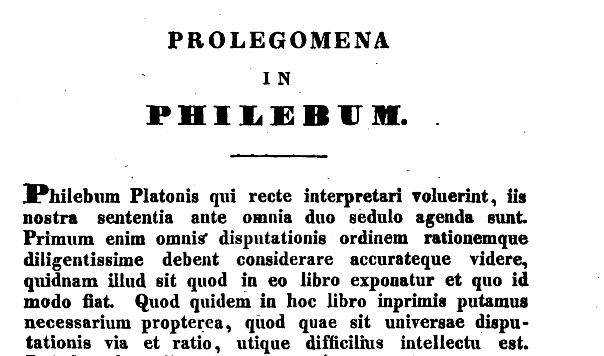

# Импорт и экспорт данных

## Рабочая директория

Любой анализ данных начинается с импорта данных. Прежде чем что-то делать, проверьте свою рабочую директорию при помощи `getwd()` ([подробнее](https://youtu.be/z7pOxe6dDG0)). Для смены можно использовать как **абсолютный**, так и **относительный** путь:

```{r eval=FALSE}
setwd("/Users/olga/R_Workflow/Text_Analysis_2023")

# искать в текущей директории
setwd("./Text_Analysis_2023")

# перейти на уровень вверх
setwd("../")
```

## Скачивание файлов из Интернета

Основная функция для скачивания файлов из Сети -- `download.file()`, которой необходимо задать в качестве аргументов url, название сохраняемого файла, иногда также метод.

Попробуем скачать датасет из [Репозитория открытых данных по русской литературе и фольклору](https://dataverse.pushdom.ru/dataverse/openlit) под названием ["Байрон в русских переводах 1810--1860-х годов"](https://dataverse.pushdom.ru/dataset.xhtml?persistentId=doi:10.31860/openlit-2019.11-R002).

```{r eval=FALSE}
url <- "https://dataverse.pushdom.ru/api/access/datafile/:persistentId?persistentId=doi:10.5072/openlit-2019.11-R002/VQRXXK"

# если url начинается с https, на Mac _может_ потребоваться указать method = "curl"
download.file(url, destfile = "files/Byron.tab") 
```

После этого в папке files появится новый файл. Получить список скачанных файлов можно при помощи `list.files()`.

```{r}
list.files("./files", pattern = "\\.tab")
```

## Чтение табличных данных

Основные функции для чтения табличных данных в базовом R - это `read.table()` и `read.csv()`.

### csv и tsv

Файл, который мы скачали, имеет расширение `.tab`. Такие файлы по структуре аналогичны файлам `.tsv` (tab separated values). Чтобы его прочитать, используем `read.table()`, указав тип разделителя:

```{r}
Byron <- read.table("files/Byron.tab", sep = "\t", header = TRUE)

head(Byron)
```

Функция `read.csv()` отличается лишь тем, что автоматически выставляет значения аргументов `sep = ","`, header = TRUE.

В диалекте tidyverse для импорта подобных файлов используется функция read_csv из пакета `readr`[^05-import-1].

[^05-import-1]: <https://r4ds.had.co.nz/data-import.html>

Вернемся к нашему датасету про буккроссинг, файлы которого имеют расширение csv. К сожалению, это не всегда гарантия того, что перед вами действительно csv:

```{r warning=FALSE, message=FALSE}
library(readr)
users <- read_csv("files/BX/BX-Users.csv", show_col_types = FALSE)
head(users)
```

Чтобы исправить дело, воспользуемся другой функцией из того же пакета:

```{r warning=FALSE}
users <- read_delim("files/BX/BX-Users.csv", delim = ";", show_col_types = FALSE)
users
```

Очевидно, это не решает всех проблем, но как справиться с оставшимися, мы рассказывали в уроке об опрятных данных.

### xls и xlsx

Не самый любимый аналитиками, но очень распространенный тип файлов. Чтобы с ним работать, нужно установить пакет `readxl` из семейства tidyverse[^05-import-2]. Это не единственный пакет для работы с Excel, но, пожалуй, самый удобный. Файл с самыми популярными на Amazon книгами можно взять [здесь](https://www.kaggle.com/datasets/palanjali007/amazons-top-50-bestselling-novels-20092020).

[^05-import-2]: <https://readxl.tidyverse.org/>

```{r}
library(readxl)
amazon <- read_excel("files/AmazonBooks.xlsx")
head(amazon)
```

Можно указать отдельные листы, которые необходимо прочитать.^[https://r4ds.hadley.nz/spreadsheets]

## Чтение текстовых данных

### txt

Для чтения текстовых файлов в базовом R есть функция `readlines()`. Аргумент `n` указывает, сколько строк прочитать; при `n = 1` функция дойдет до первого переноса строки или параграфа.

```{r}
readLines(con = "files/karamzin_liza.txt", n = 1) 
```

### doc

Если есть возможность конвертировать документ Word в простой текстовый формат, то лучше так и сделать. Если нет, то устанавливаем пакет `officer`.

```{r message=FALSE}
library(officer)
files <- list.files(path = "files", pattern = "docx") 

# read file
doc <- read_docx(paste0("files/", files[1]))
content <- docx_summary(doc) 
head(content, 2) # весь текст доступен в столбце text
```

Таким образом, однако, мы теряем все сноски. Следующий код позволяет их достать:

```{r eval=F}
library(xml2)
xml_text(xml_find_all(doc$footnotes$get(), "*"))
```

Тут уже применяются функции для работы с xml. Поэтому лишний раз подумайте, не проще ли конвертировать документ Word в .txt.

### pdf

С pdf тоже без нужды лучше не иметь дела. Но если все-таки пришлось читать pdf, для этого есть пакет `pdftools`[^05-import-3].

[^05-import-3]: <https://rpubs.com/kbodwin/pdftools>

```{r message=FALSE}
library(pdftools)

# длинющий вектор, который придется очищать от \n (новая строка)
liza <- pdf_text(pdf = "files/karamzin_liza.pdf")

# метаданные в виде списка
meta <- pdf_info(pdf = "files/karamzin_liza.pdf")
meta$created
```

Разработчики утверждают, что пакет справится и с распознаванием текста, но для этого должен быть установлен пакет `tesseract`.

```{r eval=FALSE}
install.packages("tesseract")
```

Возможно, сначала вам придется установить нужные языки. Код ниже вы можете попробовать выполнить самостоятельно, указав актуальный путь до файла.

```{r eval=F}
library(tesseract)
tesseract_download("deu")
text <- pdf_ocr_text("./files/German.pdf", language = "deu")
cat(text)
```

### png

Тот же фокус сработает и с изображениями. Но точность распознавания сильно зависит от качества картинки.

```{r}
# tesseract_download("lat")
lat <- tesseract::tesseract("lat")
text <- tesseract::ocr("./images/latin.png", engine = lat)
cat(text)
```



### zip

Для работы с архивами есть функция `unzip()`. Полезно помнить, что большой архив не обязательно распечатывать полностью. Если выставить аргумент `list = TRUE`, то функция вернет список всех файлов в архиве, из которых можно прочитать в память лишь избранные:

```{r}
archive <- unzip("files/archive.zip", files = NULL, list = TRUE) 
archive
```

Код ниже позволяет извлечь из архива только нужный файл:

```{r eval=F}
unzip("files/archive.zip", files = "AmazonBooks.xlsx")
```

После этого файл можно прочитать в R, как указано выше.

## Структурированные данные

### json

Формат JSON (JavaScript Object Notation) предназначен для представления структурированных данных. JSON имеет шесть основных типов данных[^05-import-5]. Четыре из них - скаляры[^05-import-6]:

[^05-import-5]: <https://r4ds.hadley.nz/rectangling#json>

[^05-import-6]: Массив строк, который имеет только один элемент, также называется строковым скаляром

-   Самый простой тип - `null` (нуль), который играет ту же роль, что и `NA` в R. Он представляет собой отсутствие данных.
-   Строка (string) похожа на строку в R, но в ней всегда должны использоваться двойные кавычки.
-   Число аналогично числам в R; поддерживается целочисленная (например, 123), десятичная (например, 123.45) или научная (например, 1,23e3) нотация JSON не поддерживает `Inf`, `-Inf` или `NaN`.
-   Логическое значение аналогично `TRUE` и `FALSE` в R, но использует строчные буквы `true` и `false`.

Строки, числа и булевы значения в JSON очень похожи на символьные, числовые и логические векторы в R. Основное отличие заключается в том, что скаляры JSON могут представлять только одно значение. Для представления нескольких значений необходимо использовать один из двух оставшихся типов: массивы и объекты.

И массивы, и объекты похожи на списки в R, разница заключается в том, именованы они или нет. **Массив** подобен безымянному списку и записывается через `[]`. Например, `[1, 2, 3]` - это массив, содержащий 3 числа, а `[null, 1, "string", false]` - массив, содержащий ноль, число, строку и булево значение. 

**Объект** подобен именованному списку и записывается через `{}`. Имена (ключи в терминологии JSON) являются строками, поэтому должны быть заключены в кавычки. Например, {"x": 1, "y": 2} - это объект, который сопоставляет x с 1, а y -- с 2.

Загрузим небольшой файл `TBBT.json`, хранящий данные о сериале "Теория большого взрыва" ([источник](https://gist.github.com/sahithyandev/540c82170a19f97deef9e23796083f01)).


```{r message=FALSE}
library(jsonlite)

path <- "./files/TBBT.json"
tbbt <- fromJSON(txt =  path,
                 simplifyVector = T)
```

Функция `fromJSON()` вернет нам список, который мы выборочно преобразуем в тиббл:

```{r message=FALSE}
cast_tbl <- tbbt$casting %>% 
  transpose() %>% 
  map(as.character) %>% 
  as_tibble()

cast_tbl
```

Проделаем то же самое для списка эпизодов, но немного другим способом. 

```{r}
episodes_tbl <- tibble(
  episode_id = map_chr(tbbt$episode_list, pluck, "episode_id"),
  title = map_chr(tbbt$episode_list, pluck, "title"))

episodes_tbl
```

</br>

:::{.task .code}
Самостоятельно создайте тиббл, в котором будет храниться количество серий для каждого сезона.
:::


{ width="50%" }


### xml

**XML** (от англ. eXtensible Markup Language) --- расширяемый язык разметки. Слово "расширяемый" значит, что список тегов не зафиксирован раз и навсегда: пользователи могут вводить свои собственные теги и создавать так называемые **настраиваемые языки разметки**. Один из таких настраиваемых языков -- это **TEI** (Text Encoding Initiative).

Большая часть размеченных литературных корпусов хранится именно в таком виде. Это очень удобно, и вот почему: документы в формате XML, как и документы в формате HTML, содержат данные, заключенные в теги, но если в формате HTML теги определяют оформление данных, то в формате XML теги нередко *определяют структуру и смысл данных*. С их помощью мы можем достать из документа именно то, что нам интересно: определенную главу, речи конкретных персонажей, слова на иностранных языках и т.п. Добавлять и удалять разметку может любой пользователь в редакторе XML кода. По сути, это просто текст, хотя и причудливо (на первый взгляд) оформленный.

Подбробнее о структуре XML документов и способах работы с ними вы можете прочитать в книгах: [@nolan2014] и [@xml2004]. Здесь мы лишь кратко затронем вопрос о том, как **парсить** XML документ в R, то есть извлекать из него нужную нам информацию.

Главное, что надо понимать: любой XML документ представляет собой иерархически организованное дерево, у которого есть один и только один корневой элемент, из которого расходятся ветви.

С этим деревом в R можно работать двумя способами: либо как со списком, который содержит другие вложенные в него списки, либо при помощи синтаксиса XPath. В видео по [ссылке](https://vk.com/video/playlist/-211800158_1) вы можете ближе познакомиться и с тем, и с другим подходом.

В качестве примера загрузим еще один датасет "Пушкинсого дома", подготовленный Д.А. Скоринкиным: ["Персонажи «Войны и мира» Л. Н. Толстого: вхождения в тексте, прямая речь и семантические роли"](https://dataverse.pushdom.ru/dataset.xhtml?persistentId=doi:10.31860/openlit-2022.1-C005). 

Функция `xmlTreeParse()` разбирает XML-файл и генерирует R-структуру, представляющую дерево XML. Парсинг xml начинается с поиска корневого элемента.

```{r}
library(XML)
filename = "files/War_and_Peace.xml"
doc <- xmlTreeParse(filename, useInternalNodes = T)
rootnode <- xmlRoot(doc)
```

После этого можно внимательнее взглянуть на структуру xml. Корневой элемент расходится на две ветви. Полностью они нам пока не нужны, узнаем только имена:

```{r}
names(xmlChildren(rootnode)) 
```

Очевидно, что что-то для нас интересное будет спрятано в ветке text, глядим на нее (индексирование как для списков):

```{r}
names(xmlChildren(rootnode[["text"]])) 
```

Итак, текст делится на какие-то пять частей. Функция `xmlGetAttr()` позволяет узнать значение атрибута `type`: как выясняется, это том.

```{r}
# это список
divs_1 <-  rootnode[["text"]][["div"]] 
xmlGetAttr(divs_1, "type")
```

Добраться до определенного узла можно не только путем индексирования, но и -- гораздо удобнее -- пр помощи синтаксиса XPath. Для этого просто указываем путь до узла. Попробуем спуститься на уровень ниже:

```{r}
divs_2 <- getNodeSet(doc, "/tei:TEI//tei:text//tei:div//tei:div", 
                     namespaces = c(tei = "http://www.tei-c.org/ns/1.0")) 

length(divs_2)
```

Теперь мы получили довольно длинный список (375 элементов), к которому снова можем применить `xmlGetAttr()`. Выясняем, что это, в основном, главы:

```{r}
unique(sapply(divs_2, xmlGetAttr, "type"))
```

Чтобы извлечь текст из конкретного узла, нужна функция `xmlValue`.

```{r}
# забираем 2, т.к. 1 -- это часть, а не глава
chapter_1 <- xmlValue(divs_2[[2]])
```

Распечатывать весь текст первой главы не будем (это очень длинный вектор); разобъем текст на строки и выведем первую и последнюю:

```{r}
library(stringr)
chapter_lines <- str_split(chapter_1, pattern = "\n")

chapter_lines[[1]][[5]]
chapter_lines[[1]][[838]]
```

Первая и последняя реплика по-французски: все правильно! Подробнее о работе с XML (и HTML) стоит посмотреть [вот это](https://www.coursera.org/lecture/data-cleaning/reading-xml-cieIu) видео.

P.S. Для работы с XML также подходит пакет `xml2`[^05-import-4].

[^05-import-4]:  <https://xml2.r-lib.org/>

</br>

:::{.task .code}

:::

</br>

### html

Язык **HTML** применяется для создания стандартных веб-страниц. Больше о работе с html вы узнаете из урока о веб-скрапинге.

## GutenbergR

Пакет `GutenbergR`[^05-import-7] поможет достать тексты из библиотеки [Gutenberg](https://www.gutenberg.org/ebooks/), но будьте осторожны: распознаны они не всегда хорошо и порой содержат много разного шума, например примечания редактора, номера страниц и т.п. В билингвах источник и перевод могут идти вперемешку. И если в XML подобные элементы будут окружены соответствующими тегами, которые позволят их легко отбросить при анализе, то Gutenberg дает вам сырой текст. Часто его надо хорошенько чистить при помощи регулярных выражений или даже вручную. 

Поиск нужного текста лучше начать с изучения метаданных:

[^05-import-7]: <https://cran.r-project.org/web/packages/gutenbergr/vignettes/intro.html>

```{r}
library(gutenbergr)

# метаданные содержат множество NA 
gutenberg_authors
gutenberg_metadata
```

Функция `gutenberg_works()` позволяет уточнить, какие столбцы необходимо вернуть:

```{r}
latin_works <- gutenberg_works(languages = "la") 

latin_works
```

Беглый взгляд на эту таблицу говорит о том, что в галактике Гутенберга царит полный хаос: например, в поле "название" хранится имя автора. Но после того, как нужный автор или нужное сочинение найдены, можно сделать так:

```{r}
caesar <- gutenberg_works(author == "Caesar, Julius", languages = "la") 
caesar 
```

Чтобы извлечь отдельный текст (тексты):

```{r}
de_bello_gallico <- gutenberg_download(218, meta_fields = "title", mirror = "ftp://mirrors.xmission.com/gutenberg/")
de_bello_gallico
```

::: infobox
Существует несколько зеркал библиотеки Gutenberg, и, если при выполнении функции `gutenberg_download()` возникает ошибка "could not download a book at <http://aleph.gutenberg.org/>", то следует использовать аргумент mirror. Список зеркал доступен по ссылке: <https://www.gutenberg.org/MIRRORS.ALL>
:::
