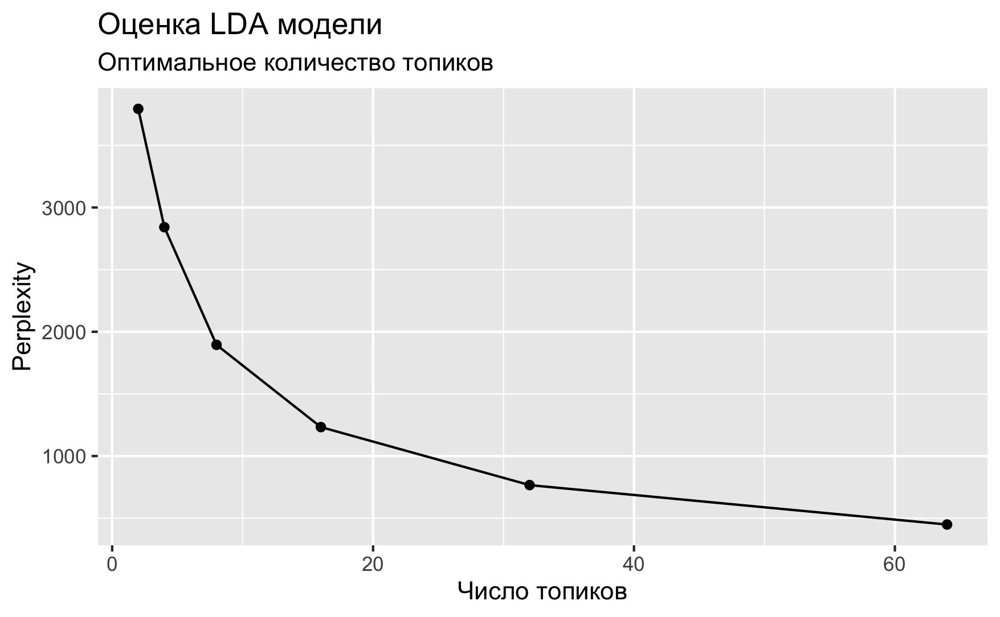

# Тематическое моделирование

## Что такое LDA 

Приступая к анализу текстов (текст-майнингу), мы часто хотим разделить большую коллекцию документов на некие естественные группы, например, тематические. Одним из способов такого деления является *тематическое моделирование*.

*Латентное размещение Дирихле* (LDA) - особенно популярный метод для построения тематической модели. В нем каждый документ рассматривается как смесь тем, а каждая тема - как смесь слов. Это позволяет документам "перекрывать" друг друга по содержанию, а не разделяться на отдельные группы, что отражает типичное использование естественного языка. Например, мы можем представить коллекцию документов по истории искусства, в которой будут тексты о живописи, архитектуре и фотографии. Тема искусства будет представлена во всех документах, где-то может быть будет сочетание 2-3 тем сразу. 


Чем-то работа LDA похожа на то, как мы размечаем текст текстовыделителями: например, в этом курсе зеленым можно выделить код, желтым -- математические и статистические отступления, а розовым -- окологуманитарные сюжеты. Как вы уже поняли, ключевой вопрос в том, сколько у вас текстовыделителей. При тематическом моделировании этот параметр задается вручную, и дальше мы посмотрим, как это делается.

## Распределение Дирихле

Математические и статистические основания LDA достаточно хитроумны, но к счастью пользоваться моделью можно и без погружения в интегралы, как можно водить машину, не умея собрать двигатель внутреннего сгорания. 

Общие принципы на русском языке хорошо изложены [в статье "Как понять, о чем текст, не читая его"](https://sysblok.ru/knowhow/kak-ponjat-o-chem-tekst-ne-chitaja-ego/) на сайте "Системный блок".


Альфа и бета на этой схеме - **гиперпараметры** распределения.  Гиперпараметры регулируют распределения тем по документам и слов по темам. Наглядно это можно представить так:


При α = 1 получается равномерное распределение: темы распределены равномерно (заметим, что α также называют "параметром концентрации"). При значениях α > 1 выборки начинают концентрироваться в центре треугольника, представляя собой равномерную смесь всех тем. При низких значениях альфа α < 1 большинство наблюдений находится в углах -- скорее всего, в в этом случае в документах будет меньше смешения тем^[https://www.mithilaguha.com/post/topic-modeling-and-latent-dirichlet-allocation]. Распределение документов по топикам θ зависит от значения α, где θ ~ Dir(α). Из θ выбирается конкретная тему Z на основе распределения. 

Аналогичным образом гиперпараметр 𝛽 управляет распределением слов по темам. При меньших значениях 𝛽 темы, скорее всего, будут больше различаться. Распределение слов φ темы Z ~ Dir(β). Конкретное слово W выбирается уже из этого распределения.

Можно представить себе банкетный зал со столами: если их несколько, и они стоят по углам, то вероятность встретить вашего знакомого в углу выше, чем в центре зала. Если он при этом вегетарианец, вы его будете искать у стола с овощами, а не с котлетами. 

Метафору можно понимать двояко. С одной стороны, ваш знакомый -- это слово, а стол -- тема, или топик. Он может нечаянно прибиться к другому углу, как и слово "футбол" может оказаться в финансовых новостях. Но это сближение не будет таким устойчивым, как, например, связь слова "банк" с финансовым топиком. 

С другой стороны, сами "документы" склонны прибиваться к определенным топикам: открыв газету, вы не ожидаете увидеть в одной статье новости вирусологии, педагогики и финансового регулирования ~~такое бывает только в блогах~~.

## Подготовка данных

Чтобы понять возможности алгоритма, мы попробуем передать ему архив телеграм-канала Antibarbari. Он хранится в репозитории этого курса на GitHub, откуда его можно скачать и повторить эксперимент. Но любому моделированию всегда предшествует подготовка данных, согласно древней мудрости garbage in - garbage out. 

Нужные мне html уже лежат в рабочей директории (2 файла); но при парсинге сайтов, в принципе, действует похожая логика. 

```{r message=FALSE}
library(xml2)
library(rvest)
library(tidyverse)

messages <- read_html("./files/antibarbari_archive/messages.html")
messages2 <- read_html("./files/antibarbari_archive/messages2.html")
```

Cледующий код позволяет достать только те узлы div, у которых значение атрибута  class = text.

```{r}
text <- html_elements(messages, "div.text") %>% 
  html_text()
text2 <- html_elements(messages2, "div.text") %>% 
  html_text()
```

Сшиваем и смотрим, что получилось.

```{r}
text <- as_tibble(text)
text2 <- as_tibble(text2)
text <- text %>% bind_rows(text2)
dim(text)

text
```

Обычная рутина: удаляем сноски, переносы строки, числа, имейлы, хэштеги и т.п. Для подобной работы нужно уверенное знание regex; если забыли, можно вернуться к уроку выше и повторить.

```{r}
text_clean <- text %>% 
  mutate(value = str_replace_all(value, "(http|https)(\\S+)", " ")) %>% 
  mutate(value = str_replace_all(value, "\\d{2}\\.\\d{2}\\.\\d{4}", " ")) %>% 
  mutate(value = str_replace_all(value, "\n", " ")) %>% 
  mutate(value = str_replace_all(value, "\\W[-A-Za-z0-9_.%]+\\@[-A-Za-z0-9_.%]+\\.[A-Za-z]+", " "))

text_clean
```

Каждому документу (посту в Telegram) следует добавить id, иначе при разделении на слова мы потеряем данные об их происхождении.

```{r}
text_clean <- text_clean %>% 
  mutate(id = paste0("doc_", row_number()), .before = value)
```

Теперь можно лемматизировать. Как это делать, мы уже знаем. 

```{r}
library(udpipe)
russian_syntagrus <- udpipe_load_model(file = "russian-syntagrus-ud-2.5-191206.udpipe")

text_ann <- udpipe_annotate(russian_syntagrus, text_clean$value)

text_tbl <- as_tibble(text_ann) %>% 
  select(doc_id, lemma)
```

```{r}
text_tbl
```

Загружаем список стоп-слов для русского языка: возвращаясь к метафоре с банкетом, это салфетки. Они лежат на всех столах и нам не интересны. 

```{r}
library(stopwords)
stop <- stopwords(language = "ru", source = "stopwords-iso") %>% 
  as_tibble() %>%
  rename(lemma = value)
```

Помимо стоп-слов, в нашем тиббле осталось много лишнего: смыйлы, пунктуцация, латинские и греческие слова, и т.п. Я решила оставить только кириллицу, чтобы немного снизить разреженность матрицы. 

```{r message=FALSE}
text_tidy <- text_tbl %>%
  mutate(lemma = str_replace_all(lemma, "[Сс]ылка|[Чч]асть", " ")) %>% 
  mutate(lemma = tolower(lemma)) %>% 
  anti_join(stop) %>% 
  mutate(lemma = str_replace_all(lemma, 
                                "[[^\u0400-\u04FF]]", "")) %>% # только кириллица
  filter(nchar(lemma) > 0)

text_tidy
```


## Матрица встречаемости

Поскольку LDA -- вероятностная модель, то на входе она принимает целые числа. В самом деле, не имеет смысла говорить о том, что некое распределение породило 0.5 слов или того меньше. Поэтому мы считаем абсолютную, а не относительную встречаемость -- и не tf_idf^[https://datascience.stackexchange.com/questions/21950/why-we-should-not-feed-lda-with-tfidf/49704#49704?newreg=c17592380de141cf9064c9c5ef09cdc6].  

```{r}
text_count <- text_tidy %>% 
  group_by(doc_id, lemma) %>% 
  count(lemma)

text_count
```

Для работы с LDA в R устанавливаем пакет `topicmodels`. На входе нужная нам функция этого пакета принимает такую структуру данных, как  _document-term matrix_ (dtm), которая используется для хранения сильно разреженных данных и происходит из популярного пакета для текст-майнинга `tm`.

Поэтому "тайдифицированный" текст придется для моделирования преобразовать в этот формат, а полученный результат вернуть в опрятный формат для визуализаций^[https://www.tidytextmining.com/topicmodeling.html]. 

Для преобразования подготовленного корпуса в формат dtm воспользуемся возможностями пакета `tidytext`:

```{r}
library(tidytext)

text_dtm <- text_count %>% 
  cast_dtm(doc_id, term = lemma, value = n)

text_dtm
```
Убеждаемся, что почти все ячейки в нашей матрице -- нули (100% разреженность). 

## Число тем

Количество тем для модели всегда задается вручную. Мы не всегда заранее знаем, сколько тем в нашем корпусе, и здесь на помощь приходит функция `perplexity()` из `topicmodels`. Она показывает, насколько подогнанная модель **не** соответствует данным -- поэтому чем значение меньше, тем лучше. 

Подгоним сразу несколько моделей с разным количеством тем и посмотрим, какая из них покажет себя лучше. Выполнение кода ниже займет какое-то время.

```{r}
library(topicmodels)
```

```{r eval=FALSE}
n_topics <- c(2, 4, 8, 16, 32, 64)
text_lda_compare <- n_topics %>%
  map(LDA, x = text_dtm, 
      control = list(seed = 0211))
```

```{r eval=FALSE}
data_frame(k = n_topics,
           perplex = map_dbl(text_lda_compare, perplexity)) %>%
  ggplot(aes(k, perplex)) +
  geom_point() +
  geom_line() +
  labs(title = "Оценка LDA модели",
       subtitle = "Оптимальное количество топиков",
       x = "Число топиков",
       y = "Perplexity")
```



Если верить графику, предпочтительны 64 темы (на самом деле, если подогнать еще больше моделей, то и все 200). Но спешить не стоит.

> Если эксперт задаст в параметрах своей программы слишком мало тем, то разные самостоятельные топики сольются в один и станут неразличимы для взгляда исследователя. Если будет задано слишком большое число топиков, то помимо реальных тем, присутствующих в корпусе, появятся «паразитные», которые с точки зрения математического аппарата показывают совместно встречающиеся слова, однако на практике эти слова не будут образовывать тематически самостоятельных контекстов. Поэтому процесс тематического моделирования включает этап подбора нужного количества топиков и соизмерение получившихся результатов с разноплановыми соображениями.
>
> [Источник](https://shagi.ranepa.ru/files/shagi22_2/shagi22_2_11.pdf)

Мои разноплановые соображения говорят, что реально больше 10 топиков выделять непродуктивно. Однако на график все же стоит обратить внимание: будем готовы к тому, что тексты действительно не группируются по понятным темам (рубрикам).   

## Модель LDA

```{r}
text_lda <- LDA(text_dtm, k = 10, control = list(seed = 0211))
```

Итак, наша тематическая модель готова. Осталось понять, что с ней делать.

## Слова и темы 

Пакет `tidytext` дает возможность "тайдифицировать" объект lda с использованием разных методов. Метод β ("бета") извлекает вероятность того, что слово происходит из данного топика. 

```{r}
text_topics <- tidy(text_lda, matrix = "beta")

text_topics %>% 
  filter(term == "огурец")
```

Например, слово "огурец" с вероятностью $3.72 \cdot 10^{-44}$ "порождено" темой 1, и с вероятностью $1.98 \cdot 10^{-3}$ -- темой 9 (похожие значения для темы 4). Ура, мы нашли огуречную тему.

Посмотрим на главные термины в первых четырех топиках.

```{r message=FALSE}
text_top_terms <- text_topics %>% 
  group_by(topic) %>% 
  arrange(-beta) %>% 
  slice_head(n = 12) %>% 
  ungroup()

text_top_terms
```

```{r}
text_top_terms %>% 
  filter(topic < 5) %>% 
  mutate(term = reorder(term, beta)) %>% 
  ggplot(aes(term, beta, fill = factor(topic))) +
  geom_col(show.legend = FALSE) + 
  facet_wrap(~ topic, scales = "free", ncol=2) +
  coord_flip()
```

В "огуречной" теме обнаружились также "тыква" и "растения". Видимо, наш алгоритм вполне адекватно "узнал" плодово-овощную рубрику Ирины Макаровой, в которой она рассказывает, что и зачем выращивали древние греки и римляне. Слово "месяц" в этом контексте тоже вполне осмысленно: ведь садовод следит за календарем! 

Тем не менее, "мальва" убежала в топик 1. Это может быть связано с тем, что в постах про мальву упоминаются Пифагор и древние пифагорейцы. Возможно, что от садовой-огородной тематики "мальва" прибивается к философской.

Чтобы проверить это допущение, сравним топик 1 и топик 4 по формуле: $log_2\left(\frac{β_2}{β_1}\right)$. 

Если $β_2$ в 2 раза больше $β_1$, то логарифм будет равен 1; если наоборот, то -1. 

:::infobox
На всякий случай: $\frac{1}{2} = 2^{-1}$.
:::

Для подсчетов снова придется трансформировать данные.

```{r}
beta_spread <- text_topics %>% 
  filter(topic %in% c(1, 4)) %>% 
  mutate(topic = paste0("topic_", topic)) %>% 
  spread(topic, beta) %>% 
  filter(topic_1 > .001 | topic_4 > .001) %>%
  mutate(log_ratio = log2(topic_4 / topic_1))

beta_spread 
```

На графике выглядит понятнее:

```{r}
beta_log_ratio <- beta_spread %>%
  filter(!log_ratio %in% c(Inf, -Inf)) %>% 
  mutate(sign = case_when(log_ratio > 0 ~ "pos",
                          log_ratio < 0 ~ "neg")) %>%
  select(-topic_1, -topic_4) %>% 
  group_by(sign) %>% 
  arrange(desc(abs(log_ratio))) %>% 
  slice_head(n = 10)
```

```{r warning=FALSE}
beta_log_ratio %>% 
  ggplot(aes(reorder(term, log_ratio), log_ratio, fill = sign)) +
  geom_col(show.legend = FALSE) +
  xlab("термин") +
  ylab("log2 beta_4 / beta_1") +
  coord_flip()
```

Слова в теме 1 достаточно общие (кроме слова "Ленин"), но видно, что больше технической  терминологии, в то время как в теме 4 присутствуют "весна" и "июнь". 

## Темы и документы

Распределение тем по документам хранит матрица gamma.

```{r}
text_documents <- tidy(text_lda, matrix = "gamma")

text_documents %>% 
  filter(topic == 4) %>% 
  arrange(-gamma)
```

Значение gamma можно понимать как долю слов в документе, происходящую из данного топика. Например, тема 4 представлена в документе 288. Посмотрим на него:

```{r}
doc_288 <- text_clean %>% 
  filter(id == "doc_288") %>% 
  pull(value) 

paste0(substr(doc_288, 1, 279), "...")
```

Заметим, однако, что в документах 648 и 635 овощи и фрукты не упоминаются. Тема включает в себя не только съедобные слова. 

Каждый документ в рамках LDA рассматривается как собрание тем. Значит, сумма всех гамм для текста должна быть равна единице. Проверим. 

```{r}
text_documents %>% 
  filter(document == "doc288") %>% 
  summarise(sum = sum(gamma))
```

Все верно! 

Теперь отберем несколько длинных постов и посмотрим, какие топики в них представлены. 

```{r}
long_posts <- text_clean %>% 
  mutate(char = nchar(value)) %>% 
  arrange(-char) %>% 
  slice_head(n = 6) %>% 
  pull(id)

long_posts <- str_remove_all(long_posts, "_")
long_posts
```


```{r}
text_documents %>% 
  filter(document %in% long_posts) %>% 
  arrange(-gamma) %>% 
  ggplot(aes(as.factor(topic), gamma, color = document)) + 
  geom_boxplot(show.legend = F) +
  facet_wrap(~document)
```

Из длинных постов 332 и 731 относятся к топику 2. Первый из них посвящен понятию "даймон" у греков, а второй -- рецепции образа Иксиона у Шекспира. %63 (тоже топик 2) -- о переписке Цицерона и Аттика. Оба этих слова мы видели выше на графике. 

## Распределения вероятности для топиков

```{r warning=FALSE}
text_documents %>% 
  ggplot(aes(gamma, fill = as.factor(topic))) +
  geom_histogram(show.legend = F) +
  facet_wrap(~ topic, ncol = 5) + 
  scale_y_log10() +
  labs(title = "Распределение вероятностей для каждого топика", 
       y = "Число документов",
       x = expression(gamma))
  
```
Почти ни одна тема не распределена равномерно: гамма чаще всего принимает значения либо около нуля, либо в районе единицы. Тема 8 немного отклоняется от этого правила. 

```{r}
text_top_terms %>% 
  filter(topic == 10)
```

Действительно, здесь встречаются слова, которые возможны почти в любом посте: "древнегреческий" и "латынь". Можно сказать, что это своего рода метатопик, характеризующий тематику канала в целом. 

```{r}
save(text_documents, file = "./data/Gamma.Rdata")
```
