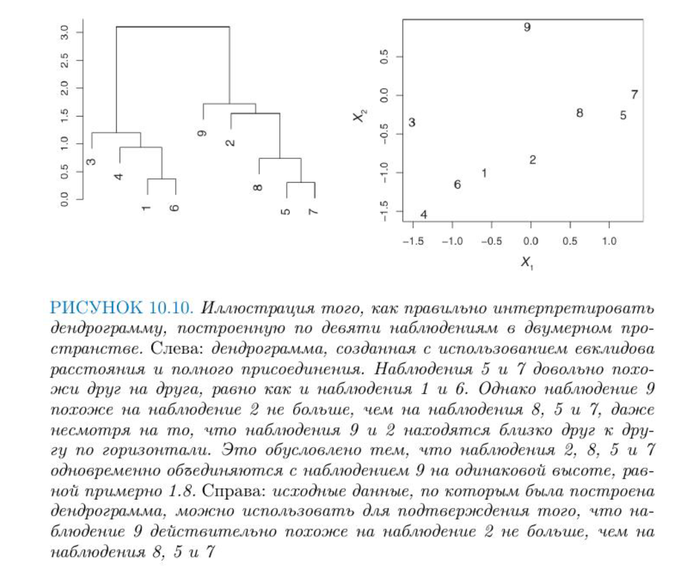
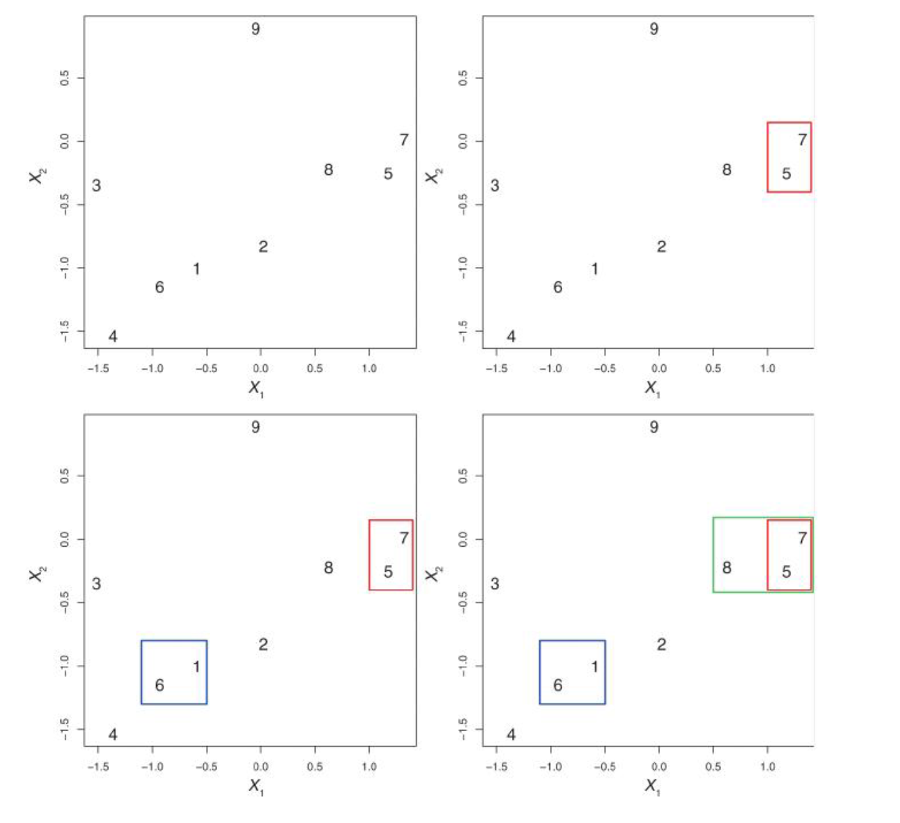
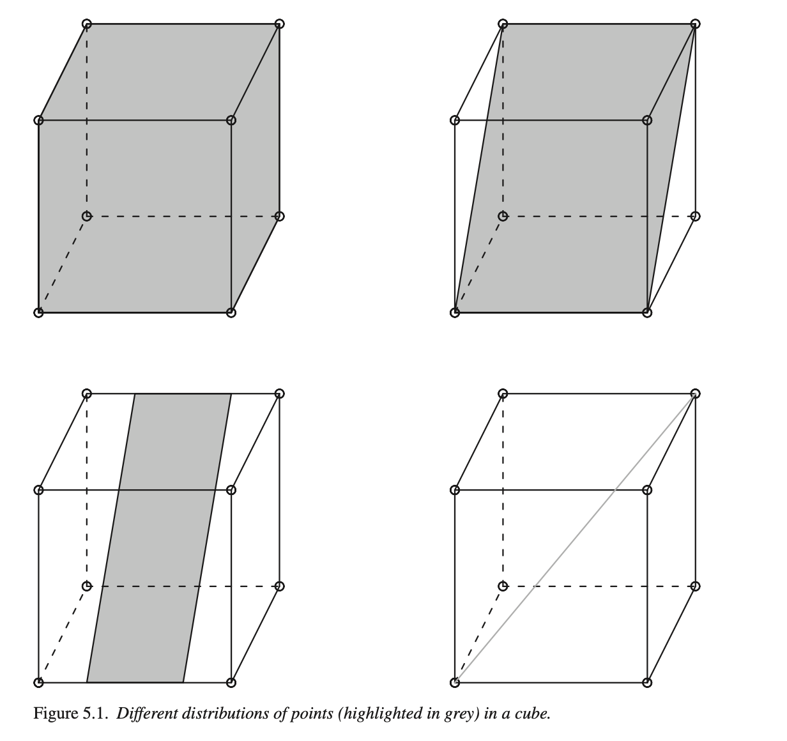

# Кластеризация и метод главных компонент

## Виды кластерного анализа

Все методы машинного обучения делятся на методы **обучения с учителем** и методы обучения без учителя. В первом случае у нас есть некоторое количество признаков X, измеренных у n объектов, и некоторый отклик Y. Задача заключается в предсказании Y по X. Например, мы измерили вес и пушистость у сотни котов известных пород, и хотим предсказать породу других котов, зная их вес и пушистость.

**Обучение без учителя** предназначено для случаев, когда у нас есть только некоторый набор признаков X, но нет значения отклика. Например, есть группа котов, для которых мы измерили вес и пушистость, но мы не знаем, на какие породы они делятся. 

**Кластеризация** относится к числу методов для обнаружения неизвестных групп (кластеров) в данных. Точнее, это целый набор методов. Мы рассмотрим два из них: 
- кластеризация по методу K средних
- иерархическая кластеризация

В случае с кластеризацией по методу K средних мы пытаемся разбить наблюдения на некоторое заранее заданное число кластеров. Иерархическая кластеризация возвращает результат в виде дерева (**дендрограммы**), которая позволяет увидеть все возможные кластеры.

## Кластеризация по методу K средних 

Алгоритм кластеризации:

1. Каждому наблюдению присваивается случайно выбранное число из интервала от 1 до K (число кластеров). Это исходные метки


2. Вычисляется _центроид_ для каждого из кластеров. Центроид k-го класса -- вектор из p средних значений признаков, описывающих наблюдения из этого кластера;

3. Каждому наблюдению присваивается метка того кластера, чей центроид находится ближе всего к этому наблюдению (удаленность выражается обычно в виде евклидова расстояния)

4. Повторить шаги 2-3 до тех пор, пока метки классов не станут изменяться. 

Это дает возможность минимизировать **внутрикластерный разброс**: хорошей считается такая кластеризация, при которой такой разброс минимален. 

Когда центроиды двигаются, кластеры приобретают и теряют документы.


:::infobox
Внутрикластерный разброс в кластере k -- это сумма квадратов евклидовых расстояний между всеми парами наблюдений в этом кластере, разделенная на общее число входящих в него наблюдений.
:::

## K-means в R

Рассмотрим это сначала на симулированных, а затем на реальных данных. 

```{r}
set.seed(2)
x = matrix(rnorm(50 * 2), ncol = 2)
x[1:25, 1:2] = x[1:25, 1:2] + 3
x[26:50, 1:2] = x[1:25, 1:2] - 4
```

```{r}
km.out <- kmeans(x, centers = 2, nstart = 20)

km.out$cluster
```
Наблюдения разделились идеально. Вот так выглядят наши центроиды:

```{r message=FALSE}
library(tidyverse)

centers <- km.out$centers %>% 
  as_tibble()

centers
```

```{r}
library(tidyverse)

as_tibble(x) %>%
  ggplot(aes(V1, V2, color = km.out$cluster)) +
  geom_point(show.legend = F) +
  geom_point(data = centers, color = "deeppink3", 
             size = 3, alpha = 0.7)
```
Аргумент `nstart` позволяет запустить алгоритм функции несколько раз с разными начальными метками кластеров; функциия вернет наилучший результат. 

## K-means для кластеризации текстов

Я воспользуюсь данными из пакета `stylo`, где хранятся частотности 3000 наиболее частотных слов для 26 книг 5 авторов. Один из этих авторов -- таинственный Роберт Гэлбрейт, как выяснилось -- псевдоним Джоан Роулинг. 

```{r message=FALSE}
library(stylo)
data("galbraith")

galbraith[1:6, 1:5]
```

Применим к этим данным функцию `kmeans`. Этот датасет имеет формат `stylo.data`, поэтому сначала его трансформируем. Также уменьшим число переменных с 3000 до 200.

```{r}
set.seed(2)
galbraith <- as.data.frame.matrix(galbraith)[,1:200]
km.out <- kmeans(galbraith, centers = 5, nstart = 20)

km.out$cluster
```
```{r}
library(stringr)
expected <- str_remove_all(names(km.out$cluster), "_.*")

tibble(expected = expected, 
       predicted = km.out$cluster) %>% 
  group_by(expected) %>% 
  count(predicted)
```

Поскольку у нас многомерные данные, придется использовать метод главных компонент, чтобы изобразить их графически. Об этом методе я скажу ниже.

## Нормализация данных

Формула расстояния зависит от способа измерения объектов. Если одни объекты имеют больший разброс значений, чем другие, то при вычислении расстояний будут преобладать элементы с более широкими диапазонами. 

```{r}
as_tibble(t(map_df(galbraith, var)), rownames = "word")
```

Перед применением алгоритма в некоторых случаях рекомендуется изменить масштабы признаков, чтобы каждый из них вносил в формулу расстояния примерно равный вклад. 

Распространенное преобразование называется стандартизацией по Z-оценке: из значения признака Х вычитается среднее арифметическое, а результат делится на стандартное отклонение Х.

$$ X_{new} = \frac{X - Mean(X)}{StDev(X)}$$
```{r}
galbraith_norm <- scale(galbraith)
```

Снова проведем кластеризацию:

```{r}
set.seed(2)
km_out_norm <- kmeans(galbraith_norm, centers = 5, nstart = 20)
tibble(expected = expected, 
       predicted = km_out_norm$cluster) %>% 
  group_by(expected) %>% 
  count(predicted)
```

Почти все авторы разошлись по разным кластерам (кроме Роулинг), при этом Гэлбрейт в одном кластере с Роулинг.

## Иерархическая кластеризация 

Одним из недостатков кластеризации по методу K средних является то, что она требует предварительно указать число кластеров. Этого недостатка лишена иерархическая кластеризация. Если такая кластеризация происходит "снизу вверх", она называется **агломеративной**. При этом построение дендрограммы начинается с "листьев" и продолжается вплоть до самого "ствола".



При интерпретации дерева надо иметь в виду, что существует $2^{n-1}$ способов упорядочения ветвей дендрограммы, где n -- это число листьев. В каждой из точек слияния можно поменять местами наблюдения, не изменяя смысла дендрограммы. Поэтому выводы  о сходстве двух наблюдений нельзя делать на основе из близости по горизонтальной оси. См. Рис. 10.10 из книги "Введение в статистическое обучение", с. 423). На рисунке видно, что наблюдение 9 похоже на наблюдение 2 не больше, чем оно похоже на наблюдения 8, 5 и 7. Вместо этого выводы делаются, исходя из положения на вертикальной оси той точки, где происходит слияние наблюдений. 

Количество кластеров определеяется высотой, на которой мы разрезаем дендрограмму. 


Из этого следует, что одну и ту же дендрограмму можно использовать для получения разного числа кластеров.

## Алгоритм иерархической кластеризации

1. Вычислить меру различия для всех пар наблюдений. На первом шаге все наблюдения рассматриваются как отдельный кластер. 

2. Найти пару наиболее похожих кластеров и объединить их. Различие между кластерами соответствует высоте, на которой происходит их слияние в дендрограмме. 
3. Повторить шаги 1-2, пока не останется 1 кластер.



Вид дерева будет зависеть от того, какой тип присоединения вы выберете. На рисунке ниже представлено три способа: полное, одиночное, среднее. 


Обычно предпочитают среднее и полное, т.к. они приводят к более сбалансированным дендрограммам. 


Для функции `hclust()` в R по умолчанию выставлено значение аргумента `method = "complete"`.

## Иерархическая кластеризация в R

Применим алгоритм к симулированным данным, которые мы создали выше. Функция `dist()` по умолчанию считает евклидово расстояние. 

```{r}
hc.complete <- hclust(dist(x), method = "complete")
plot(hc.complete)
```
На картинке видно, что наблюдения из верхих и нижних рядов почти идеально разделились на два кластера. 

## Иерархическая кластеризация текстов

Для вычисления расстояния между текстами лучше подойдет не евклидово, а косинусное расстояние на нормализованных данных. В базовой `dist()` его нет, поэтому воспользуемся пакетом `philentropy`.

```{r}
dist_mx <- galbraith_norm %>% 
  philentropy::distance(method = "cosine", use.row.names = T) 
```
Преобразуем меру сходства в меру расстояния и передадим на кластеризацию. 

```{r}
dist_mx <- as.dist(1 - dist_mx)
hc <- hclust(dist_mx)

plot(hc)
```

Для получения меток кластеров, возникающих в результате рассечения дендрограммы на той или иной высоте, можно воспользоваться функцией `cutree()`.

```{r}
cutree(hc, 5)
```

Этим меткам можно назначить свой цвет.

```{r message=FALSE}
library(dendextend)
hcd <- as.dendrogram(hc)
par(mar=c(2,2,2,7))
hcd %>% 
  set("branches_k_color", k = 5) %>% 
  set("labels_col", k=5) %>% 
  plot(horiz = TRUE)
abline(v=0.8, col="pink4",lty=2)
```

Результат как иерархической кластеризации, так и кластеризации по методу K средних многомерных данных можно визуализировать в двумерном пространстве, если предварительно применить к данным метод главных компонент.

## Метод главных компонент

Метод главных компонент (англ. principal component analysis, PCA) — один из основных способов уменьшить размерность данных, потеряв наименьшее количество информации. Этот метод привлекается, в частности, когда надо визуализировать многомерные данные. 

Общий принцип хорошо объясняется Гаральдом Баайеном (с. 119).



Серый цвет верхнего левого куба означает, что точки распределены равномерно -- нужны все три измерения для того, чтобы описать положение точки в кубе. Куб справа сверху по-прежнему имеет три измерения, но нам достаточно только двух, вдоль которых рассеяны данные. Куб слева снизу тоже имеет два измерения, но вдоль оси y разброс данных меньше, чем вдоль x. Наконец, для куба справа снизу достаточно только одного измерения.

Метод главных компонент ищет такие измерения, вдоль которых наблюдается наибольший разброс данных, причем каждая следующая компонента будет объяснять меньше разброса. 

```{r}
pca_fit <- prcomp(galbraith, scale. = T, center = T)

names(pca_fit)
```
Первый элемент хранит данные о стандартном отклонении, соответствующем каждой компоненте. 

```{r}
round(pca_fit$sdev, 3)
```
Это можно узнать также, вызвав функцию summary.

```{r}
summary(pca_fit)
```

Доля дисперсии -- это стандартное отклонение в квадрате, деленное на сумму стандартных отклонений в квадрате. Проверим:

```{r}
round(pca_fit$sdev^2 / sum(pca_fit$sdev^2), 4)
```
Таким образом, первые две компоненты объясняют почти половину дисперсии, а последняя почти не имеет объяснительной ценности.

```{r}
plot(pca_fit)
```

Координаты текстов в новом двумерном пространстве, определяемом первыми двумя компонентами, хранятся в элементе под названием `x`.

```{r}
head(pca_fit$x[,1:2])
```
Нагрузки каждой компоненты хранятся в матрице ротации. Интерпретировать компоненты как таковые невозможно -- они представляют собой линейную комбинацию признаков. В математическом смысле главные компоненты представляют собой собственные векторы ковариационной матрицы исходных данных. 

```{r}
head(pca_fit$rotation[, 1:3])
```

Число рядов в этой матрице равно числу исходных измерений (слов); т.е. для каждого слова указаны его координаты в новом измерении. 

```{r}
dim(pca_fit$rotation[, 1:3])
```

Изобразить вместе главные компоненты и тексты позволяет функция `biplot()` (на нормализованных данных получается совсем не читаемо, поэтому демонстрирую на исходных).

```{r}
biplot(prcomp(galbraith), scale=0)
```

## PCA для визуализации кластеров K-means

Функция `augment()` из пакета `broom` позволяет соединить результат кластеризации (в данном случае -- по методу K средних) с исходными данными. 

```{r}
library(broom)

pca_fit %>%
  augment(galbraith) %>% 
  ggplot(aes(.fittedPC1, .fittedPC2, 
             color = expected, shape = as.factor(km.out$cluster))) +
  geom_point(size = 3, alpha = 0.7)
```


В таком же "опрятном" виде можем представить и нагрузки компонент. Для наглядности вывожу только первые 30 слов.


```{r warning=FALSE}
library(cowplot)
library(grid)

# как будет выглядеть стрелка
arrow_style <- arrow(
  angle = 20, ends = "first", type = "closed", length = grid::unit(8, "pt")
)

pca_fit %>%
  tidy(matrix = "rotation") %>%
  pivot_wider(names_from = "PC", names_prefix = "PC", values_from = "value") %>%
  filter(row_number() %in% c(1:30)) %>% 
  ggplot(aes(PC1, PC2)) +
  geom_segment(xend = 0, yend = 0, arrow = arrow_style, color = "darkgrey") +
  geom_text(
    aes(label = column),
    hjust = 1, nudge_x = -0.02, 
    color = "#904C2F",
    alpha = 0.7
  ) +
  theme_minimal_grid(10) +
  coord_fixed()
```


## PCA и иерархическая кластеризация

Код почти как выше, но надо указать, на сколько кластеров мы разрезаем дерево. 


```{r}
pca_fit %>%
  augment(galbraith) %>% 
  ggplot(aes(.fittedPC1, .fittedPC2, 
             color = expected, shape = as.factor(cutree(hc, 5)))) +
  geom_point(size = 3, alpha = 0.7)
```


## Многомерное шкалирование

Кроме этого, для визуализации многомерных данных применяют многомерное шкалирование. Функция получает на входе матрицу расстояний. 

```{r}
cmd_fit <- cmdscale(dist_mx) %>% as_tibble()
head(cmd_fit)
```


```{r}
cmd_fit %>%
  ggplot(aes(V1, V2, 
             color = expected, 
             shape = as.factor(cutree(hc, 5)))) +
  geom_point(size = 3, alpha = 0.7)
```


Многомерное шкалирование стремится отразить _расстояния_ между наблюдениями.

## PCA с FactoMineR

Для вычисления главных компонент в R есть множество инструментов помимо базовых. Для наглядности я пока возьму лишь 10 первых переменных (иначе будет сложно объяснить, что происходит на графике). 

```{r}
library(FactoMineR)
pca_object <- PCA(galbraith_norm[,1:10], graph = FALSE)
pca_object
```

Первый элемент списка указывает, какие компоненты наиболее важны.

```{r}
head(round(pca_object$eig, 2))
```

```{r}
barplot(pca_object$eig[,1], names.arg = paste("comp ", 1:nrow(pca_object$eig)))
```

При визуализации аргументы `shadow` и `autoLab` отвечают за то, чтобы график хорошо читался. 

```{r warning=FALSE}
plot(pca_object, shadow=T, autoLab = "yes", choix = "var", new.plot = F, title = "", col.var = "grey40")
```

Получившийся график называется *круг корреляции*, и его следует понимать так:


- положительно коррелированные переменные находятся рядом; 
- отрицательно коррелированные переменные находятся в противоположных квадрантах.

Например, для первого измерения "was" и "said" коррелированы отрицательно. Это можно проверить, достав соответствующую матрицу из объекта pca (в качестве координат используются коэффициенты корреляции между переменными и компонентами):

```{r}
pca_object$var$coord[,1:2]
```
Построим графикк с наблюдениями, а не с переменными:

```{r}
plot(pca_object, shadow = T, autoLab = "yes", title = "")
```


