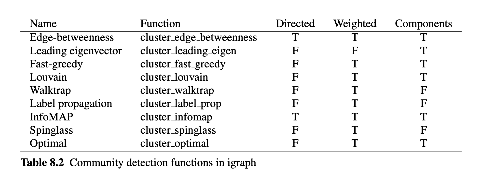

# Dracor

Мы продолжим исследовать возможности сетевого анализа с использованием корпуса Dracor. В дальнейшем я опираюсь на [презентацию](https://rpubs.com/Pozdniakov/rdracor_presentation) Ивана Позднякова, который разрабатывал DraCor Shiny app (https://shiny.dracor.org/). 

## О корпусе Dracor

DraCor — сокращение от drama corpora — это собрание размеченных по стандарту TEI драматических текстов на 11-ти языках. Здесь есть корпуса пьес на французском, немецком, испанском, русском, итальянском, шведском, португальском (только Кальдерон) и английском (только Шекспир), а также совсем небольшие коллекции эльзасских, татарских и башкирских пьес.

Два крупных корпуса пьес в составе собрания — немецкий и русский — были собраны и поддерживаются создателями проекта DraCor (часть команды из России — это Центр цифровых гуманитарных исследований Высшей школы экономики). Остальные корпуса были взяты из сторонних проектов, а затем адаптированы для совместимости с функционалом DraCor. ([Отсюда](https://sysblok.ru/philology/dracor-i-programmable-corpora-korpusa-dlja-cifrovyh-gumanitariev/)).

На сайте проекта "Системный Блок" можно прочитать серию материалов о том, как возможности Dracor используются в литературоведении:

- о "Ревизоре" [тыц](https://sysblok.ru/philology/socseti-russkoj-dramy-chast-ii-revizor-vs-gorodnichij-kto-zhe-glavnyj-geroj/)
- о плотности сетей в трагедии и комедии [тыц](https://sysblok.ru/nlp/prazdnik-ili-smert-drama-v-seti/)
- о "зоне смерти" в "Гамлете" и др. [тыц](https://sysblok.ru/philology/smert-v-seti/)

## Начало работы с Dracor

```{r message=FALSE}
# remotes::install_github("Pozdniakov/rdracor")
library(rdracor)
library(tidyverse)

get_dracor_meta() %>%
  summary()
```
Извлекаем метаданные.

```{r}
meta <- get_dracor_meta() %>%
  select(name, title, plays)

meta
```

```{r}
meta %>%
  plot()
```

```{r warning=FALSE}
shake <- get_dracor("shake")
summary(shake)
```

```{r}
shake <- as_tibble(shake)
shake
```

Тут хранится очень много всего: размер сети, плотность сети и т.д. Вот так, например, выглядят самые длинные пьесы Шекспира:

```{r}
shake %>%
  arrange(desc(wordCountText)) %>%
  select(corpus, firstAuthorName, title, wordCountText, yearWrittenMeta)
```
Распределение мужских и женских персонажей по годам:

```{r}
gender_ratio <- shake %>%
  select(title, yearWrittenMeta, numOfSpeakers, numOfSpeakersFemale, numOfSpeakersMale) %>% 
  mutate(male = numOfSpeakersMale / numOfSpeakers,
         female = numOfSpeakersFemale / numOfSpeakers) %>%
  select(-numOfSpeakers, -numOfSpeakersMale, -numOfSpeakersFemale) %>% 
  arrange(yearWrittenMeta) %>% 
  pivot_longer(cols = c(male, female), names_to = "gender") %>% 
  mutate(year = as.factor(yearWrittenMeta)) %>% 
  select(-yearWrittenMeta)

gender_ratio 
```

```{r}
gender_ratio %>%
  group_by(year, gender) %>% 
  summarise(mean = mean(value)) %>% 
  ggplot(aes(year, mean, fill = gender)) + 
  geom_col(position = "dodge") 
```

## Сети Dracor

Однако самое интересное -- это построение и анализ сетей при помощи Dracor. 

```{r}
taming <- get_net_cooccur_igraph(corpus = "shake",
                                 play = "the-taming-of-the-shrew")

taming
```

```{r}
library(ggraph)

ggraph(taming, layout = "fr") + 
  geom_edge_link(edge_alpha = 0.5) +
  geom_node_point(fill = "steelblue", 
                  size = 4,
                  alpha = 0.5, 
                  shape = 21) + 
  geom_node_text(aes(label = name), vjust = 1, hjust = 1) + 
  theme_void()
```

Для удобства я удалю некоторые узлы. Например, можно удалить групповых персонажей. В "Укрощении" это некие лица из "индукции" Вместе с ними удалю Кристофера Слая, который появляется только в ["индукции"](http://www.w-shakespeare.ru/library/shekspir-remeslo-dramaturga16.html).

```{r message=FALSE}
library(igraph)
groups <- get.vertex.attribute(taming)$isGroup
groups
```

```{r}
taming_sub <- induced_subgraph(taming, vids = -c(1:15))
ggraph(taming_sub, layout = "fr") + 
  geom_edge_link(edge_alpha = 0.5) +
  geom_node_point(aes(fill = gender),
                  size = 4,
                  alpha = 0.5, 
                  shape = 21) + 
  geom_node_text(aes(label = name), vjust = 1, hjust = 1) + 
  theme_void()
```

Теперь на примере этих данных исследуем такую характеристику сети, как модулярность.

## Модулярность

Модулярность — одна из мер структуры сетей или графов. Мера была разработана для измерения силы разбиения сети на модули (называемые группами, кластерами или сообществами). Сети с высокой модулярностью имеют плотные связи между узлами внутри модулей, но слабые связи между узлами в различных модулях.


Модулярность равна доле рёбер от общего числа рёбер, которые попадают в данные группы минус ожидаемая доля рёбер, которые попали бы в те же группы, если бы они были распределены случайно. 

Если все узлы принадлежат к одному классу, то модулярность равна нулю. Если разбиение на классы хорошее, то модулярность должна быть высокая. 

Снова загружим датасет `Moreno`, где, как мы видели, ученики 4-го класса делятся на две сети в зависимости от пола. 

```{r}
library(UserNetR)
library(intergraph)

data(Moreno)
Moreno_graph <- intergraph::asIgraph(Moreno)
plot(Moreno_graph, vertex.color = gender)
```

Метрика модулярности подтверждает, что пол учеников действительно объясняет наблюдаемую кластеризацию.

```{r}
modularity(Moreno_graph, V(Moreno_graph)$gender)
```
В графе "Укрощения..." пол явно не является определяющим (он закодирован цветом на графике выше). Чтобы убедиться в этом сначала перекодируем гендер, так как функция `modularity()` принимает числовую переменную в качестве аргумента. Значение гендера 3 (unknown) в пьесе имеют групповые персонажи.


```{r}
V(taming_sub)$gender

## male = 1
idx <- V(taming_sub)$gender=="MALE"
V(taming_sub)$gender[idx] <- 1

## female = 2
idx <- V(taming_sub)$gender=="FEMALE"
V(taming_sub)$gender[idx] <- 2

## unknown for groups
idx <- V(taming_sub)$gender=="UNKNOWN"
V(taming_sub)$gender[idx] <- 3
```

```{r}
gender <- as.numeric(V(taming_sub)$gender)
modularity(taming_sub, gender)
```

:::infobox
При выделении сообществ в большинстве случаев наша задача -- максимизировать модулярность.
:::

## Алгоритмы обнаружения сообществ

В пакете `igraph` реализовано множество алгоритмов обнаружения сообществ. Обычной практикой является применение нескольких алгоритмов и сравнение результатов. 



У нас ненаправленная взвешенная сеть. 

```{r}
taming_sub
```
Применим алгоритм "случайного блуждания".

```{r}
cw <- cluster_walktrap(taming_sub)
membership(cw)
```

```{r}
plot(cw, taming_sub)
```

Значение модулярности положительное, но не очень высокое. 

```{r}
modularity(cw)
```

Поищем другое разбиение.

```{r}
csg <- cluster_spinglass(taming_sub)
membership(csg)
```

На графе видно, что почти все слуги, портной и галантерейщик оказались в отдельном кластере, что вполне осмысленно. Но есть два кластера с одним элементом (вдова и слуги Баптисты), всего 4.

```{r}
plot(csg, taming_sub)
```

Показатели модулярности чуть выше, чем для предыдущего разбиения.

```{r}
modularity(csg)
```

Также используем алгоритм под названием "главный собственный вектор". Он выделяет всего две группы, но показатели модулярности ниже, чем для предыдущего.

```{r}
cev <- cluster_leading_eigen(taming_sub)
plot(cev, taming_sub)
modularity(cev)
```

## Двудольные графы (биграфы)

Двудольные графы подходят для ситуаций, когда существует возможность возникновения социальных взаимосвязей, но напрямую их наблюдать нельзя. Тем не менее если участники относятся к одной и той же социальной группе, можно сделать вывод, что существует возможность или потенциал развития связей между ними. Такие сети называются **сетями аффилированности** (affiliation network). 

Будет дополнено позже.

